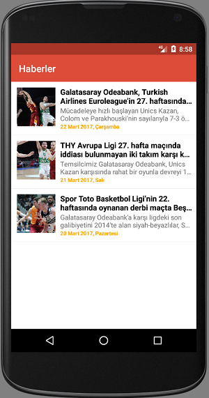

# ReactNative Haber Uygulaması

Bu örnek haberlerin listelendiği ve haber detayının görüntülendiği 2 ekrandan oluşan bir haber uygulamasıdır.

## Örnek Projeyi İndirmeden Önce

Öncelikle bilgisayarımıza Android için SDK, iOs için ise XCode kurulumlarını yapmamız gerekiyor. Ardından NPM aracılığı ile ReactNative kütüphanesini bilgisayarımıza kurmalıyız.

Tüm bu kurulumlara <a href="https://facebook.github.io/react-native/docs/getting-started.html" target="_blank">buradaki</a> linkten ulaşabilirsiniz. 

## Şimdi Projemizi Çalıştıralım

Örnek projemizi bilgisayarımıza klonluyoruz. Ardından projemizin ana dizinine gelerek **"npm install"** komutunu çalıştırıyoruz.
**"npm install"** komutu ile gerekli modüllerin indirilmesini sağlıyoruz.

Modüllerin indirilmesinden sonra Android için Android emulatörünü, ios için iPhone emulatorünü çalıştırıyoruz.

Ardından projeyi çalıştırmak projenin dizininde komut penceresini açarak aşağıdaki komut satırını yazıyoruz ve uygulamamızın emulatörde açılmasını bekliyoruz.

**Android için;**
```
react-native run-android
```

**iOs için;**
```
react-native run-ios
```



Vee hoş bi görüntü :)

# Hadi Şimdi Neler Yaptık İnceleyelim :)

Projemizde 2 önemli javascript dosyası bulunmaktadır. Bunlar;

* **index.android.js**
* **index.ios.js**

Bu dosyalar android ve ios platformlarının ana javascript dosyalarıdır. Bu dosyalarda başlangıç component'i projeye bildirilerek yaşam döngüsüne başlanır.

Peki başlangıç componentini nasıl bildiriyoruz? Aşağıdaki kod ile;

```javascript
AppRegistry.registerComponent('SampleNewsApp', () => NewsApp);
```

Burada **"SampleNewsApp"** modülümüzün **"NewsApp"** ise başlangıç component'imizin ismidir.

## index.android.js dosyasını inceleyelim

Bu dosyamızda android özelinde bazı işlemler yapılmıştır. 
Örneğin android platformunda **geri** butonu olduğu için bu butonla ilgili işlemler gerçekleştirilmiştir.

Projemizde react native kütüphanesinin bize sağladığı sayfalar arası geçiş işlemleri için **Navigator** componentini kullandık. 
Bu component ile yeni sayfa açabiliyor, önceki sayfaya dönebiliyoruz.
Ancak android platformunda **geri** butonuna basıldığında **navigator** componentimize bir önceki sayfaya dönmesi gerektiğini bildirmemiz gerekmektedir.

Bunuda aşağıdaki kod ile gerçekleştirdik.

```javascript
BackAndroid.addEventListener('hardwareBackPress', () => {
  // Eğer birden fazla ekran açılmış ise son açılan ekranı pop() metodu ile kapatıyoruz.
  if (_navigator && _navigator.getCurrentRoutes().length > 1) {
    _navigator.pop();
    return true;
  }
  return false;
});
```

Bu işlemi ios'ta yapmadık. Çünkü ios'ta **NavigatorIOS** component'i kendi içinde native olarak yönlendirmelerini gerçekleştiriyor.

Bu kodu geçtikten sonra birde **RouteMapper** dikkatinizi çekmiştir. 
İçinde android'e özel **ToolbarAndroid** componenti'de var. 
**ToolbarAndroid** android'e özel bir component'tir. Nedeni ise bu component native android toolbar'ını kullanıyor. 
Bu yüzden ios bu component'i desteklemiyor.

Şimdi aşağıdaki kodları yorum satırları ile açıklayalım.

```javascript
var RouteMapper = function (route, navigator) {
  _navigator = navigator;

  // Uygulama içinde herhangi bir ekran açmak istediğimizde navigator'e ekranın 
  // adını iletiyoruz. Burada açılacak ekranında adı news_list ise NewsListScreen
  // component'inin ekrana basılcağını (render edileceğini) belirtiyoruz.
  if (route.name === 'news_list') {
    return (
      // View component'i her iki platform'da da native view nesnesidir.
      <View style={styles.container}>

        // ToolbarAndroid component'i native olarak android'in kendi toolbar'ıdır.
        <ToolbarAndroid
          style={styles.toolbar}
          title="Haberler"
          titleColor='white' />

        // Component'lere props olarak navigator'ü geçiyoruz. Bu sayede diğer ekranlar
        // navigator sayesinde farklı ekranlara yönlendirme yapabilecekler.
        <NewsListScreen
          navigator={navigator}  />

      </View>
    );
  } else if (route.name === 'news_detail') {
    return (
      <View style={styles.container}>

        <ToolbarAndroid
          style={styles.toolbar}
          title="Haber Detayı"
          titleColor='white'/>

        <NewsDetailScreen
          navigator={navigator}
          news={route.news}  />

      </View>
    );
  }
};

```

Aşağıdaki kod ile ise ana component'imizi oluşturuyoruz.

```javascript
export default class NewsApp extends React.Component {

  render() {
    // İlk açılacak ekranın adını tanımlıyoruz.
    var initialRoute = { name: 'news_list' };
    
    // Navigator component'imizi döndürüyoruz. Burada renderScene property'sine 
    // yukarıda tanımladığımız RouterMapper'ı atıyoruz. Bu sayede her ekran değişikliği
    // istendiğinde RouterMapper metodumuza düşecek ve gerekli ekranın çizilmesi sağlanacaktır.
    return (
      <Navigator
        style={styles.container}
        initialRoute={initialRoute}
        renderScene={RouteMapper}
        />
    );
  }

}
```

## Birde ios.android.js dosyasını inceleyelim

Bu dosya android'e göre daha kısa. Burada ios'a özel **NavigatorIOS** component'ini kullanıyoruz. 
Yorum satırlarıyla kısaca üzerinden geçelim.

```javascript
export default class NewsApp extends React.Component {
  render() {
    return (
      <NavigatorIOS
        style={styles.container}
        titleTextColor='white'
        barTintColor='#dd4b39'
        tintColor='white'
        // İlk açılacak ekranı yani component'i bildiriyoruz. 
        // Title ile toolbar'daki başlığı bildiriyoruz.
        initialRoute={{
          title: 'Haberler',
          component: NewsListScreen,
        }}
      />
    );
  }
}
```

Ve her ikisi için meşhur kod (en üstte değinmiştik);

```javascript
AppRegistry.registerComponent('SampleNewsApp', () => NewsApp);
```

## Şimdide NewsListScreen.js dosyasını inceleyelim

Bu haberlerin listelendiği ekrandır.
Bu ekranda <a href="https://facebook.github.io/react-native/docs/using-a-listview.html" target="_blank">ListView</a> component'ini kullanıyoruz.

Listview ile ilgili bilgilere <a href="https://facebook.github.io/react-native/docs/using-a-listview.html" target="_blank">buradaki</a> linkten ulaşabilirsiniz.

Buradaki bazı kodları inceleyelim. Örnek olarak verilerimiz **"data/NewsDatas.js"** dosyamızdan çekiliyor.
Bu verilerimiz listview'e state aracılığı ile atıyoruz.

```javascript
// Burada bir datasource tanımlaması yapıyoruz.
// rowHasChanged kafanızı karıştırmasın. Burada veri kaynağının değişmesi halinde o anki satırdaki verinin
// yeni veri ile aynı olmaması durumunda o satırın yeniden çizilmesini söylüyoruz. 
// Umarım anlaşılır olmuştur :)
const ds = new ListView.DataSource({ rowHasChanged: (r1, r2) => r1 !== r2 });
// Veri Kaynağına NewsDatas verilerimizi atıyoruz.
this.state = {
    dataSource: ds.cloneWithRows(NewsDatas),
};
```

ListView her satırı oluşturduğunda aşağıdaki fonksiyona gelecektir. 
Bizde burada her satır için NewsItem component'imizi çizmesini söylüyoruz. 

```javascript
renderRow(news) {
    return <NewsItem
        item={news}
        onItemClick={() => this.onItemClickNews(news) }/>
}
```

// Aşağıdaki kod'da ise ListView'imize datasource'umuzu bağlıyoruz. 
Ayrıca her satırda üstteki fonksiyona gideceğini bildiriyoruz.

```javascript
render() {
    return (
        <View style={styles.container}>
            <ListView
                dataSource={this.state.dataSource}
                renderRow={this.renderRow}
                renderSeparator={this.renderSeparator}  />
        </View>
    );
}
```

Ve listeden bir satıra tıklandığında detay ekranı yönlendirmesini yapıyoruz. 
Burada ios ve android farklı navigator kullandığı için if kontrolü yaparak detay ekranına yönlendirmeyi sağlıyoruz. 

```javascript
onItemClickNews(news) {
    if (Platform.OS === 'ios') {
        this.props.navigator.push({
            title: news.title,
            component: NewsDetailScreen,
            passProps: { 
                news: news 
            },
        });
    } else {
        this.props.navigator.push({
            title: news.title,
            name: 'news_detail',
            news: news,
        });
    }
}
```

## Birde StyleSheet ile Style Atamalarına Bakalım

Neredeyse tüm ekranlarda görmüşüzdür :) **Styles.**
Aslında oldukça basittirler. Sadece property'lerini bilmek gerekiyor.

Tüm component'lerin property'lerine react'ın sitesinden ulaşabilirsiniz.

Örnek bir tanımlamaya bakalım;

```javascript

return (
    <View style={styles.container}>
        <Image style={styles.newsImage}
            source={{ uri: item.imageUrl }}/>

        <ScrollView automaticallyAdjustContentInsets={false} >
            <View style={styles.containerPanel}>

                <Text style={styles.title}>{item.title}</Text>
                <Text style={styles.content}>{item.content}</Text>

                <Text style={styles.date}>{item.date}</Text>

            </View>
        </ScrollView>

    </View>
);

var styles = StyleSheet.create({
    container: {
        flex: 1
    },
    newsImage: {
        backgroundColor: 'gray',
        flex: 1
    },
    containerPanel: {
        flex: 1,
        flexDirection: 'column',
        padding: 16
    },
    title: {
        fontSize: 16,
        fontWeight: 'bold',
        color: 'black'
    },
    content: {
        fontSize: 14,
        paddingTop: 10
    },
    date: {
        fontSize: 11,
        fontWeight: 'bold',
        color: 'orange',
        paddingTop: 10
    }
});
```

Yukarıda gördüğümüz gibi **style={styles.container}** ile style atamamızı gerçekleştiriyoruz. 
Stiller'le ilgi bilgilere daha sonraki sample'larda değiniyor olacağız.

Projemizin video'sunuda paylaşalım :)

<iframe width="560" height="560" src="https://www.youtube.com/embed/HNcKo6GxrYs" frameborder="0" allowfullscreen></iframe>
